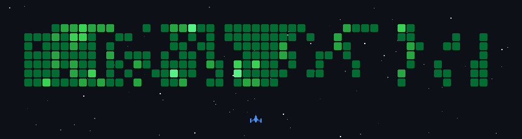

  

<h1 align="center">
  Hi, <a href="https://palchhin.netlify.app" target="_blank">Palchhin</a> here ヾ(≧▽≦*)o
</h1>

### _About Me_

I work as a freelancer in web development while continuously learning and strengthening my technical fundamentals. I enjoy building things, learning by doing, and exploring ideas through hands-on projects. I’m someone who likes to understand how things work and turn that curiosity into something tangible.

Beyond technology, I’m interested in wellness - helping people build healthy habits, learning Korean, travelling, music, and discovering new perspectives.

I’m naturally curious, always looking for something new to learn, and I enjoy picking up something meaningful from both the things I build and the experiences I have along the way. 🌿

I have conducted AI research in deepfake detection during the final semester of my bachelor's degree.

### _Tech Stack_

<table width="100%">
<tr>
  <td><b>Languages</b></td>
<td>

</td>
</tr>

<tr>
<td><b>Frontend</b></td>
<td>

</td>
</tr>

<tr>
<td><b>Backend</b></td>
<td>

</td>
</tr>

<tr>
<td><b>AI / ML</b></td>
<td>

</td>
</tr>

<tr>
<td><b>APIs & Bots</b></td>
<td>

</td>
</tr>

<tr>
<td><b>Tools</b></td>
<td>

</td>
</tr>
</table>

<!-- ### _Contribution Graph_ -->

<!-- ### _Hacktoberfest 2025_ -->

<!-- / -->

### _Find Me Here_

  

    
    
    
    
    
    
    
  

  

  <i>thanks for stopping by ~ see you next time! 🎐</i>

